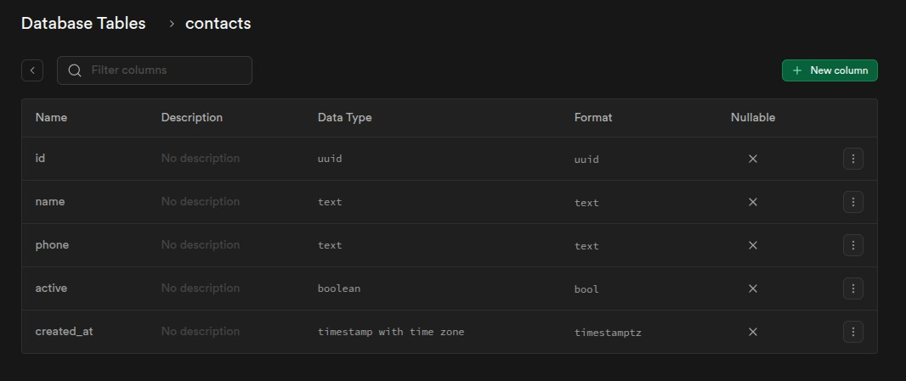
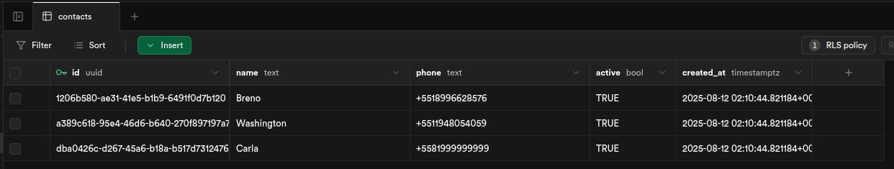
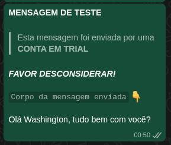
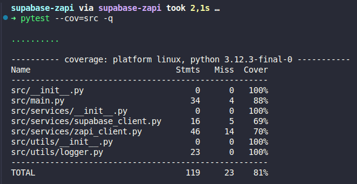

# Supabase → Z-API · Envio de WhatsApp em Python

Projeto que lê contatos no **Supabase** e envia, via **Z-API**, a mensagem **"Olá {nome}, tudo bem com você?"** para N contatos (padrão 3).  
Inclui **logs estruturados**, **testes unitários**, **Docker**, **CI (GitHub Actions)** e **Swagger (OpenAPI)** para documentação.

---

## ⚙️ Requisitos
- Python 3.12+
- Conta no [Supabase](https://supabase.com/)
- Conta/Instância na [Z-API](https://z-api.io/) com WhatsApp conectado

---

## 🧱 Estrutura
```
src/
  services/
    supabase_client.py
    zapi_client.py
  utils/
    logger.py
  main.py             # fluxo CLI: Supabase → Z-API
tests/                # pytest + respx
docs/openapi.yaml     # documentação OpenAPI (Swagger)
Dockerfile
.github/workflows/ci.yml
requirements.txt
pytest.ini            # silencia warnings e define addopts
setup.cfg             # flake8 config
.env.example
```

---

## 🗃️ Supabase — Tabela e RLS
Crie a tabela `contacts` e (se usar `anon`) habilite RLS + policy de leitura:

```sql
create table if not exists public.contacts (
  id uuid primary key default gen_random_uuid(),
  name text not null,
  phone text not null,
  active boolean not null default true,
  created_at timestamptz not null default now()
);

alter table public.contacts enable row level security;

-- Para chave ANON: libera apenas SELECT
create policy "Allow read for anon" on public.contacts
for select
to anon
using (true);
```

> **Dica:** salve os números no formato E.164 **só com dígitos** (ex.: `5511999999999`).

---

## 🔐 Variáveis de Ambiente
Copie o exemplo e edite:
```bash
cp .env.example .env
```

`.env` (exemplo):
```env
# Supabase
SUPABASE_URL=https://<project>.supabase.co
SUPABASE_ANON_KEY=eyJhbGci...

# Z-API
ZAPI_SEND_URL=https://api.z-api.io/instances/<INSTANCE_ID>/token/<TOKEN>/send-text
ZAPI_CLIENT_TOKEN=<CLIENT_TOKEN>

# App
MAX_CONTACTS=3
LOG_LEVEL=INFO
LOG_FILE=.logs/app.log
```

> `ZAPI_SEND_URL` usa `/send-text`, payload `{"phone":"5511...","message":"..."}` e header `Client-Token` (da aba **Segurança**).

---

## ▶️ Como Rodar (CLI)
### Ambiente local
```bash
python -m venv .venv
source .venv/bin/activate
python -m pip install -r requirements.txt
python -m src.main
```

### Docker
```bash
docker build -t supabase-zapi .
docker run --env-file .env supabase-zapi
```

---

## 🔎 Testes & Qualidade
```bash
python -m pip install -r requirements.txt
pytest --cov=src -q
flake8 src tests --max-line-length=88
```

### O que é testado
- `build_message()` (mensagem exata)
- Normalização do telefone (só dígitos)
- Envio via Z-API (mock HTTP com `respx`, incluindo retry 5xx)

---

## 📄 Swagger (documentação)
A especificação OpenAPI está em `docs/openapi.yaml`.

Visualizar:
1. Acesse https://editor.swagger.io/
2. `File → Import File` → selecione `docs/openapi.yaml`

---

## 🧰 Decisões Técnicas
- **Chave `anon` vs `service_role`**: `anon` exige policy de leitura; `service_role` ignora RLS (não recomendado em produção).
- **Telefone**: normalização para **somente dígitos** (Z-API `/send-text` exige assim).
- **Retry**: erros 5xx têm backoff exponencial (até 3 tentativas). 4xx não fazem retry.
- **Logs**: níveis via `.env`, console e arquivo rotacionado.

---

## Demonstração

### 1. Estrutura da tabela (Supabase)


### 2. Registros (Supabase)


### 3. Execução do script


### 4. Mensagens recebidas (WhatsApp)


### 5. Testes automatizados


---

## 📜 Licença
MIT — veja o arquivo `LICENSE`.
